# Complex U-Net Architecture - Detailed View

```mermaid
%%{init: {'theme':'dark', 'themeVariables': { 'fontSize':'16px', 'fontFamily':'monospace'}}}%%
flowchart TD
    %% Styling for dark theme with high contrast
    classDef inputStyle fill:#2E7D32,stroke:#4CAF50,stroke-width:3px,color:#E8F5E9,font-weight:bold
    classDef encoderStyle fill:#1565C0,stroke:#42A5F5,stroke-width:3px,color:#E3F2FD,font-weight:bold
    classDef bottleneckStyle fill:#F57C00,stroke:#FFB74D,stroke-width:3px,color:#FFF3E0,font-weight:bold
    classDef decoderStyle fill:#C2185B,stroke:#F06292,stroke-width:3px,color:#FCE4EC,font-weight:bold
    classDef outputStyle fill:#7B1FA2,stroke:#BA68C8,stroke-width:3px,color:#F3E5F5,font-weight:bold
    
    %% Input Layer
    Input["<b>Input</b><br/>(8,4,2,12)<br/>Channel + Position Encoding"]:::inputStyle
    Reshape1["<b>Reshape</b><br/>(32,2,12)<br/>Merge ports to batch"]:::inputStyle
    
    %% Encoder Path
    Enc1["<b>Encoder-1</b><br/>(32,32,12)<br/>ResBlock + Attention"]:::encoderStyle
    Down1["<b>DownSample-1</b><br/>(32,32,6)<br/>Conv1d k=2, s=2"]:::encoderStyle
    
    Enc2["<b>Encoder-2</b><br/>(32,64,6)<br/>ResBlock + Attention"]:::encoderStyle
    Down2["<b>DownSample-2</b><br/>(32,64,3)<br/>Conv1d k=2, s=2"]:::encoderStyle
    
    Enc3["<b>Encoder-3</b><br/>(32,128,3)<br/>ResBlock + Attention"]:::encoderStyle
    Down3["<b>DownSample-3</b><br/>(32,128,1)<br/>Conv1d k=2, s=2"]:::encoderStyle
    
    %% Bottleneck
    Bottleneck["<b>Bottleneck</b><br/>(32,256,1)<br/>ResBlock + Attention"]:::bottleneckStyle
    
    %% Decoder Path
    Up1["<b>UpSample-1</b><br/>(32,128,3)<br/>ConvTranspose1d k=2, s=2"]:::decoderStyle
    Cat1["<b>Concat-1</b><br/>(32,256,3)<br/>Cat with Enc3"]:::decoderStyle
    Dec1["<b>Decoder-1</b><br/>(32,128,3)<br/>ResBlock + Attention"]:::decoderStyle
    
    Up2["<b>UpSample-2</b><br/>(32,64,6)<br/>ConvTranspose1d k=2, s=2"]:::decoderStyle
    Cat2["<b>Concat-2</b><br/>(32,128,6)<br/>Cat with Enc2"]:::decoderStyle
    Dec2["<b>Decoder-2</b><br/>(32,64,6)<br/>ResBlock + Attention"]:::decoderStyle
    
    Up3["<b>UpSample-3</b><br/>(32,32,12)<br/>ConvTranspose1d k=2, s=2"]:::decoderStyle
    Cat3["<b>Concat-3</b><br/>(32,64,12)<br/>Cat with Enc1"]:::decoderStyle
    Dec3["<b>Decoder-3</b><br/>(32,32,12)<br/>ResBlock + Attention"]:::decoderStyle
    
    %% Output Layer
    OutConv["<b>Output Conv</b><br/>(32,1,12)<br/>Conv1d k=1"]:::outputStyle
    Reshape2["<b>Reshape</b><br/>(8,4,1,12)<br/>Restore ports dimension"]:::outputStyle
    Output["<b>Final Output</b><br/>(8,4,1,12)<br/>Denoised Channel Estimate"]:::outputStyle
    
    %% Flow - Main path with thick arrows
    Input ==> Reshape1
    Reshape1 ==> Enc1
    Enc1 ==> Down1
    Down1 ==> Enc2
    Enc2 ==> Down2
    Down2 ==> Enc3
    Enc3 ==> Down3
    Down3 ==> Bottleneck
    
    Bottleneck ==> Up1
    Up1 ==> Cat1
    Enc3 -.->|<b>Skip</b>| Cat1
    Cat1 ==> Dec1
    
    Dec1 ==> Up2
    Up2 ==> Cat2
    Enc2 -.->|<b>Skip</b>| Cat2
    Cat2 ==> Dec2
    
    Dec2 ==> Up3
    Up3 ==> Cat3
    Enc1 -.->|<b>Skip</b>| Cat3
    Cat3 ==> Dec3
    
    Dec3 ==> OutConv
    OutConv ==> Reshape2
    Reshape2 ==> Output
```

**Network Parameters:**
- Batch Size: 8
- Num Ports: 4
- Sequence Length: 12
- Input Channels: 2 (Channel estimate + Position encoding)
- Output Channels: 1 (Residual)
- Base Channels: 32
- Network Depth: 3
- Attention: Enabled (ComplexAttention)
- Activation: ComplexModReLU
- Normalization: ComplexBatchNorm1d

**Key Features:**
- Full complex number support
- Encoder-decoder structure with skip connections
- Residual blocks + Attention at each layer
- Adaptive to different sequence lengths (12-816)
- Independent position encoding for each port

**Data Flow:**
1. Input: (B, P, C, L) = (8, 4, 2, 12)
2. Reshape: Merge ports to batch -> (32, 2, 12)
3. Encoder: Progressive downsampling and feature extraction
4. Bottleneck: Deepest feature representation
5. Decoder: Progressive upsampling with skip connections
6. Output: (32, 1, 12) -> Reshape -> (8, 4, 1, 12)

**Each Port Gets Independent Output:**
- Port 0, 1, 2, 3 each produces a 12-length complex sequence
- Total output shape: (8 batches, 4 ports, 1 channel, 12 length)
