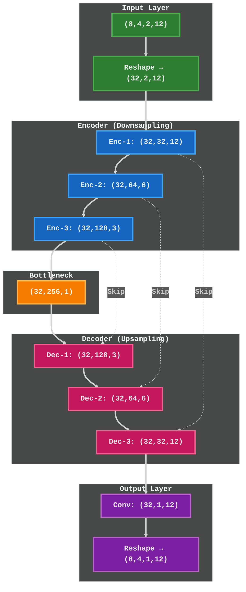

# Complex U-Net Architecture - Simplified View

**Simplified Architecture Overview**

This diagram shows the high-level structure:
- **Input**: (8,4,2,12) → Reshape → (32,2,12)
- **Encoder**: 3 levels of downsampling (12→6→3→1)
- **Bottleneck**: Deepest representation at (32,256,1)
- **Decoder**: 3 levels of upsampling (1→3→6→12) with skip connections
- **Output**: (32,1,12) → Reshape → (8,4,1,12)

Each port independently processed throughout the network.
